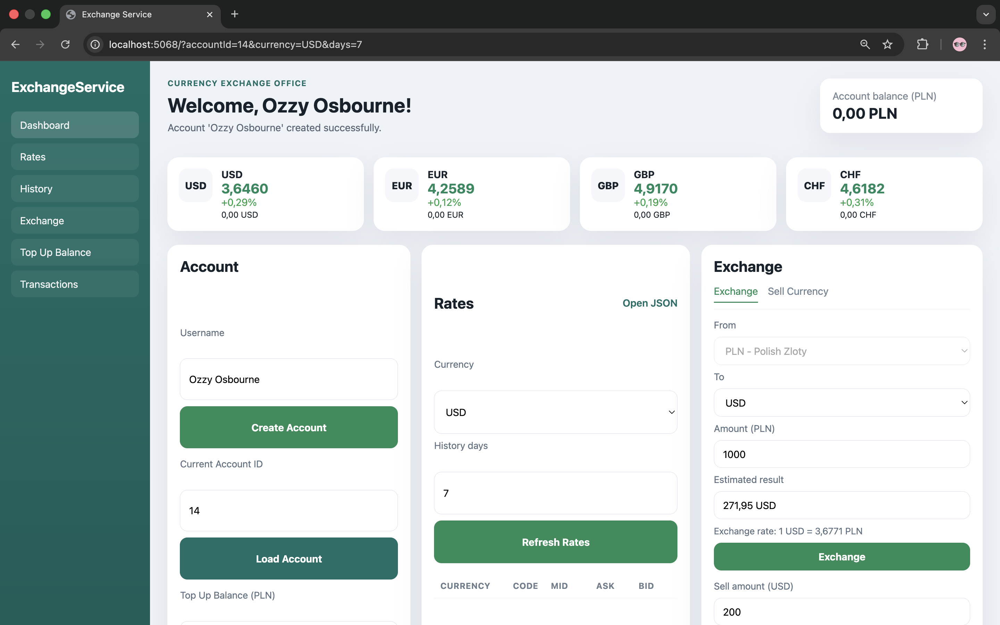
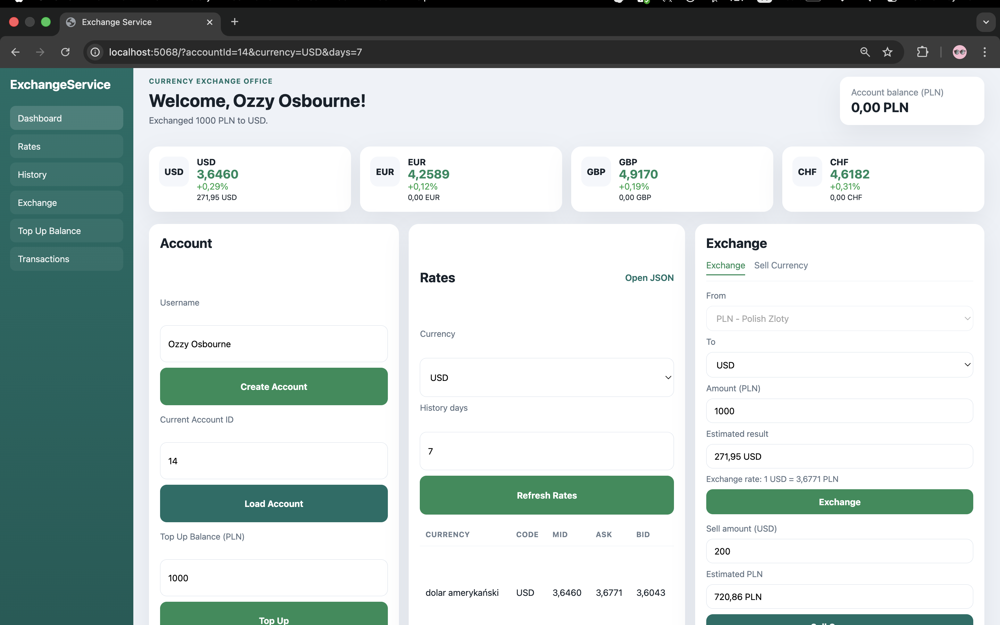
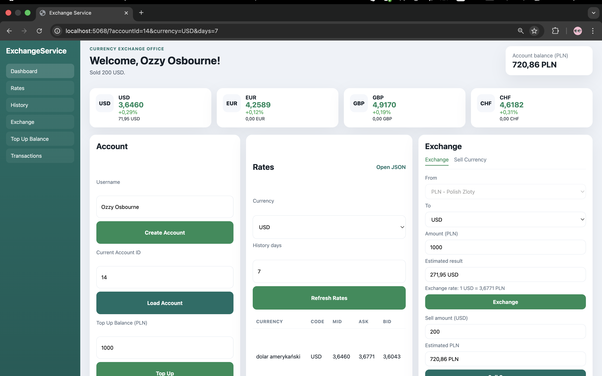
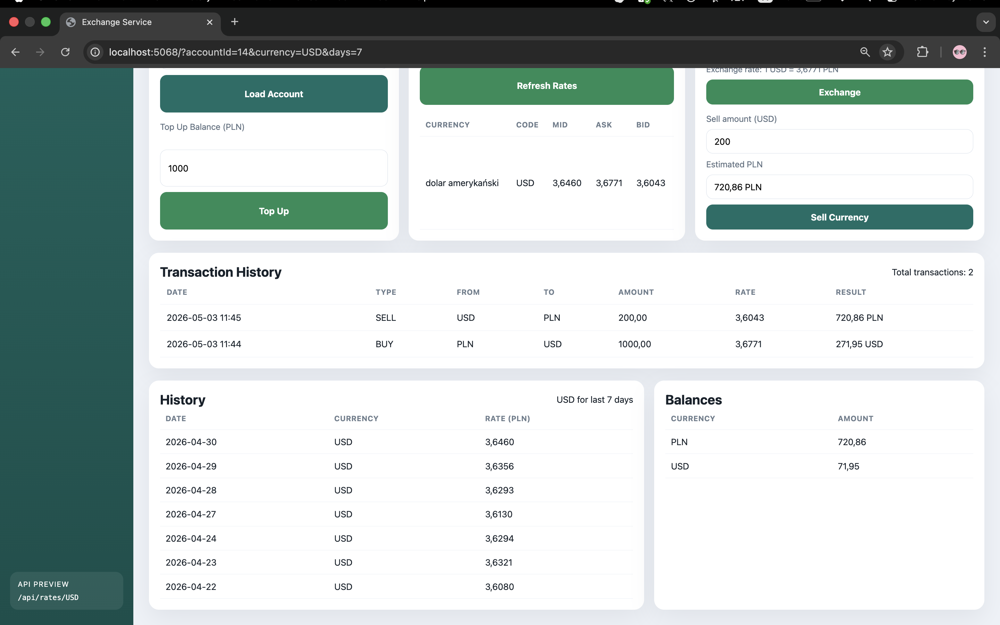

---

**Documentation/Project-Documentation.md**

```md
# Project Documentation
## Currency Exchange Office System

## 1. Project Overview

The purpose of this project was to develop a network-based application simulating the functionality of an online currency exchange office.

The system allows the user to:
- create an account,
- top up a virtual PLN balance,
- retrieve current exchange rates,
- retrieve historical exchange rates,
- buy currencies,
- sell currencies,
- view balances,
- view transaction history.

The application uses real exchange rate data obtained from the National Bank of Poland API.

---

## 2. System Architecture

The project was implemented as a web application using ASP.NET Core MVC.

The main architectural components are:

- **Controllers**  
  Handle HTTP requests, user actions, and API endpoints.

- **Models**  
  Represent application data such as accounts, balances, transactions, and exchange rates.

- **Data**  
  Contains the database context and persistence configuration.

- **Services**  
  Contain the business logic and communication with the NBP API.

- **Views**  
  Provide the browser-based user interface.

- **wwwroot**  
  Contains static frontend resources such as styles and scripts.

This structure separates presentation, business logic, and data access.

---

## 3. Implemented Features

The system includes the following functionality:

### 3.1 Account Management
- User account creation
- Loading an existing account
- Storing user data in the database

### 3.2 Balance Top-Up
- Simulated top-up of the PLN balance
- Automatic update of the stored balance

### 3.3 Exchange Rates
- Retrieval of current exchange rates from the NBP API
- Support for currencies such as USD, EUR, GBP, and CHF
- Display of rate information in the user interface

### 3.4 Historical Rates
- Retrieval of historical exchange rates for a selected currency
- Display of historical data in tabular form

### 3.5 Currency Exchange
- Buying currency using PLN
- Selling foreign currency back to PLN
- Automatic balance recalculation based on current rates

### 3.6 Transaction History
- Storage of exchange transactions in the database
- Display of transaction history to the user

---

## 4. Technologies Used

The project was implemented using the following technologies:

- .NET
- C#
- ASP.NET Core MVC
- Entity Framework Core
- SQLite
- HttpClient
- National Bank of Poland API
- Razor Views
- HTML
- CSS

---

## 5. Database Design

The application uses SQLite as the database engine.

The database stores:

- **Accounts**  
  User account information

- **CurrencyBalances**  
  Current balances of user currencies

- **Transactions**  
  Currency exchange operations performed by users

This allows the application to persist user data between sessions.

---

## 6. External API Integration

The application integrates with the National Bank of Poland API.

The API is used to retrieve:
- current exchange rates,
- historical exchange rates.

The communication is implemented using `HttpClient`.

Example API endpoints exposed by the application:
- `/api/rates/USD`
- `/api/rates/history/USD?days=7`

---

## 7. How the System Works

1. The user opens the web application in the browser.
2. The user creates or loads an account.
3. The user can top up a PLN balance.
4. The application retrieves live exchange rates from the NBP API.
5. The user can buy or sell currency.
6. The transaction is saved in the database.
7. Balances and transaction history are updated and displayed.

---

## 8. Example Usage Scenario

Example scenario:

1. Create an account named `Ozzy Osbourne`
2. Top up `1000 PLN`
3. Check the current USD rate
4. Buy USD using PLN
5. Check updated balances
6. View transaction history
7. Retrieve historical USD exchange rates
8. Sell part of the USD balance back to PLN

##  Example Screenshots

### 1. Account Created


### 2. Balance Top-Up


### 3. Buy USD


### 4. Sell USD


### 5. Transaction History


---

## 9. Platform Note

This project was developed and tested on macOS.

---

## 10. Conclusion

The project demonstrates the development of a network-based application on the .NET platform for a currency exchange office scenario.

It includes:
- a browser-based user interface,
- backend business logic,
- integration with an external public API,
- database persistence,
- transaction and balance management.

The final result is a complete and working exchange office system.
